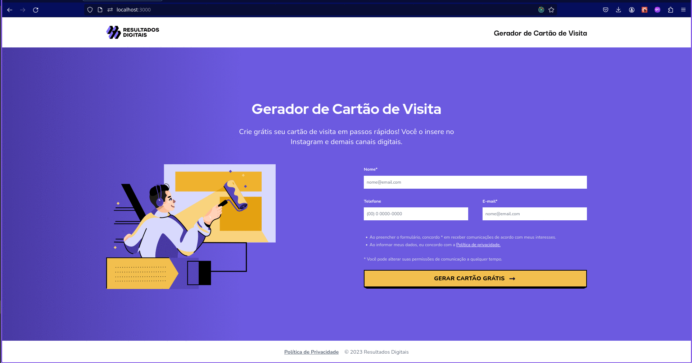

# Business Card Generator

# 

## Sobre o Projeto

Conheça o fantástico (e fictício) Gerador de Cartão de Visita do Resultados Digitais,
uma aplicação que permite que os usuários criem cartões de visitas digitais. Nesta
aplicação, os usuários devem preencher os campos da primeira página e assim que
avançarem poderão visualizar seu novo cartão de visitas.

Sua interface visual foi desenvolvida utilizando as seguintes tecnologias:

- [Next.js](https://nextjs.org/)
- [Tailwind](https://tailwindcss.com/)
- [TypeScript](https://www.typescriptlang.org/)
- [html2pdf.js](https://ekoopmans.github.io/html2pdf.js/)
- [Zod](https://zod.dev/)
- [Vscode](https://code.visualstudio.com/)

## Para executar o projeto

- Clonar todo o repositório
- Comandos para rodar o projeto após o clone:

  ```
  npm install
  npm run dev
  ```
